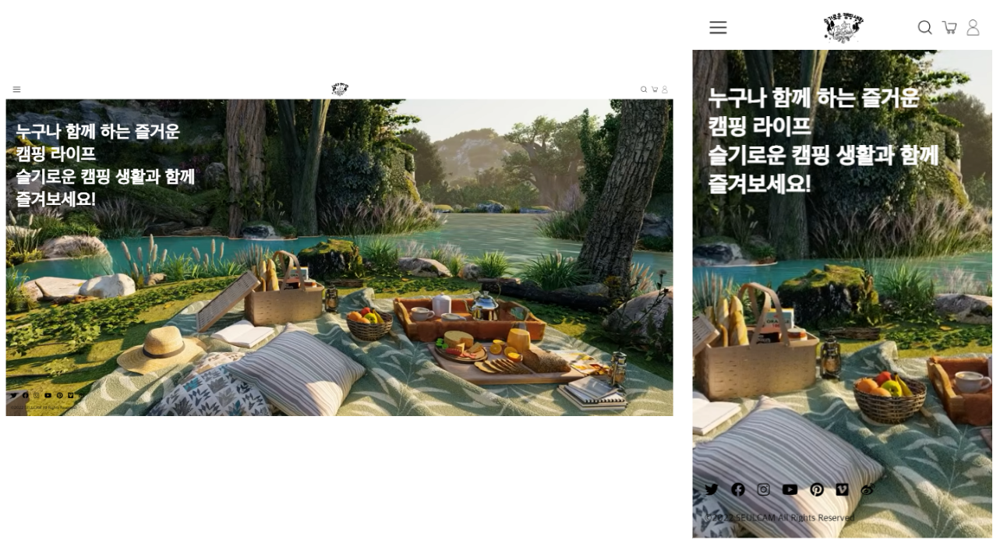
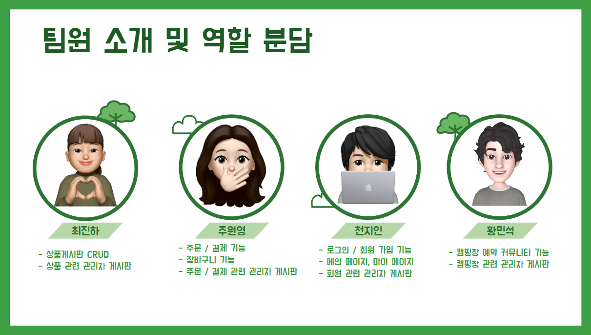
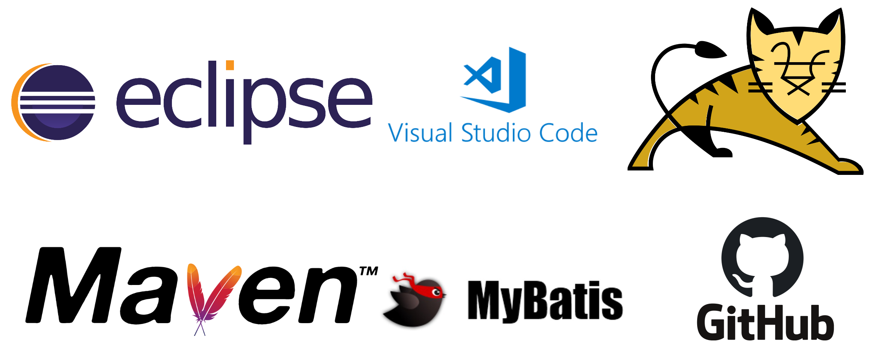
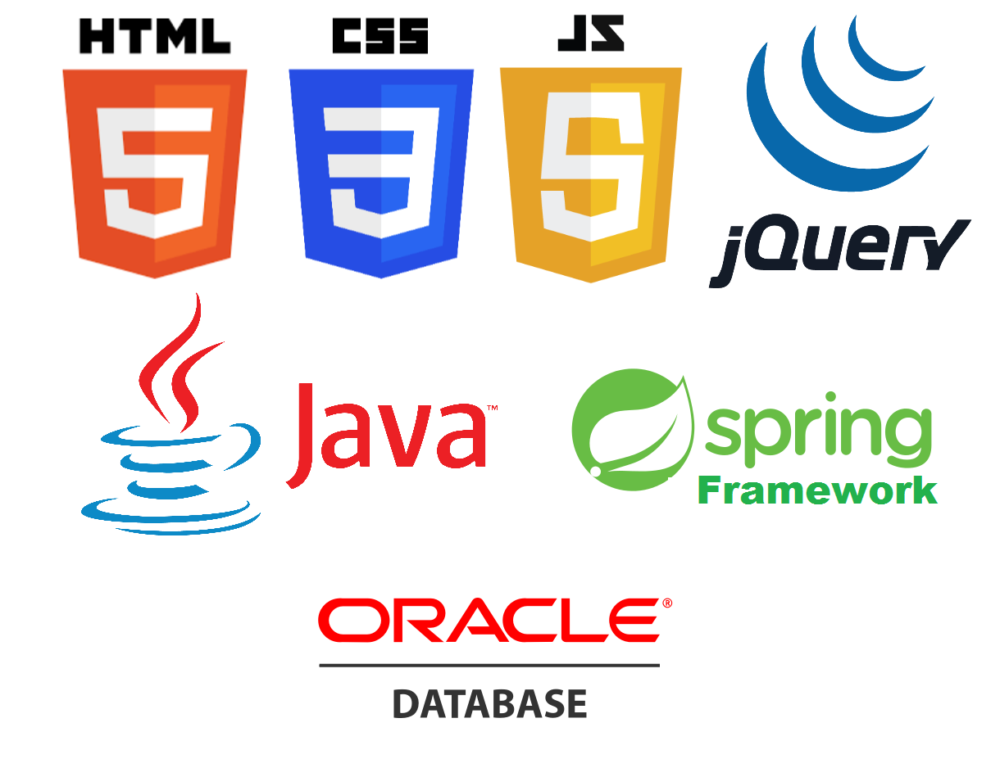

<h1 align="center">🏕️슬기로운 캠핑 생활</h1>

  

## :film_projector: [웹버전 시연영상](https://youtu.be/21dfU2m0mz4) :iphone: [모바일버전 시연영상](https://www.youtube.com/watch?v=zY-UIjQ4CIA) :loudspeaker:[기획보고서](https://docs.google.com/presentation/d/1Ca5pK43d-58go0l-kLcL0n4C1WrkNRMsRplX9AVcZqE/edit?usp=sharing)

<h2 align="center">📅프로젝트 소개</h2>

유명한 브랜드부터 떠오르는 브랜드들까지 모두 모아놓은 캠핑 용품계의 무신사, 캠핑 브랜드 멀티샵 기능과 전국의 캠핑장을 조회하고 예약할 수 있는 캠핑 계의 야놀자 기능을 합쳐놓은 서비스입니다.

<h2 align="center">📅개발 기간</h2>

2022-10-17 ~ 2022-11-18

<h2 align="center">👪멤버 구성</h2>

  

<h2 align="center">🛠️개발 환경</h2>

  

<h2 align="center">⚙️기술 스택</h2>

  

<h2 align="center">📱주요 기능 및 상세</h2>

<h2 align="center">✔︎레퍼런스</h2>

이 프로젝트는 무신사와 아더에러 사이트를 참고하여 학습용으로 작업 되었습니다.

