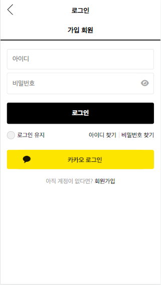
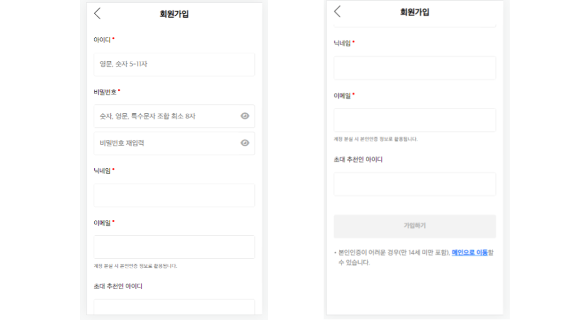
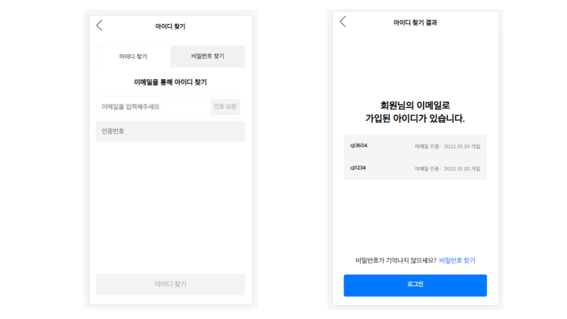
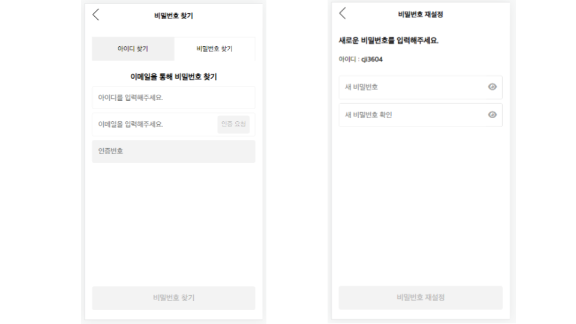
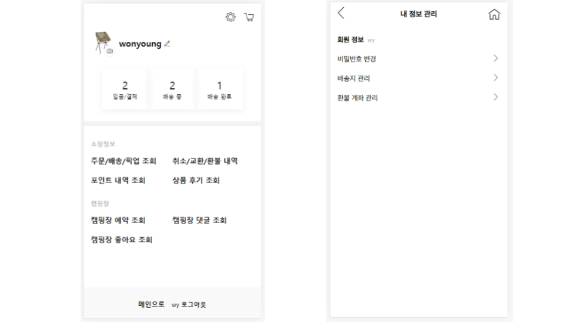
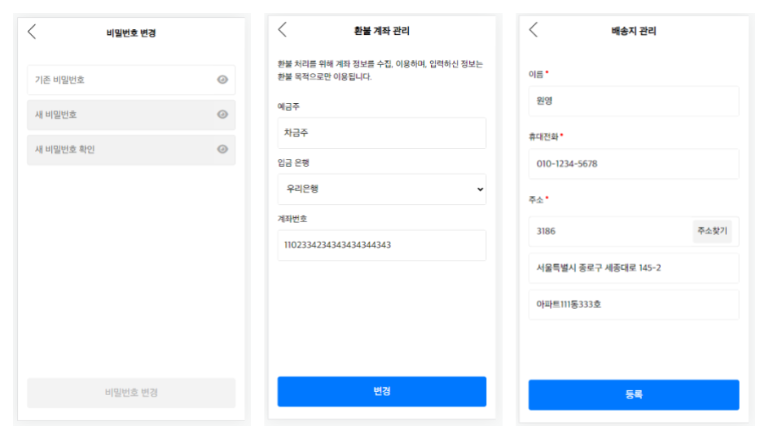
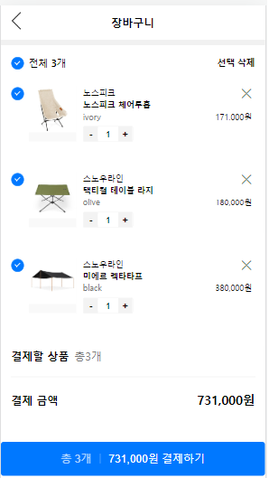

<h1 align="center">🏕️슬기로운 캠핑 생활</h1>

  

## :film_projector: [웹버전 시연영상](https://www.youtube.com/watch?v=tM0a6sy8VtI&list=PL0Fb5v3WxYRMTRXyPUl8NzQaxd4hE250B&index=1) :iphone: [모바일버전 시연영상](https://www.youtube.com/watch?v=zY-UIjQ4CIA) :loudspeaker:[기획보고서](https://drive.google.com/file/d/1KE9CfjvQqt_Vganzauj1QlP7Xih74dyl/view?usp=sharing)

<h2 align="center">📅프로젝트 소개</h2>

유명한 브랜드부터 떠오르는 브랜드들까지 모두 모아놓은 캠핑 용품계의 무신사, 캠핑 브랜드 멀티샵 기능과 전국의 캠핑장을 조회하고 예약할 수 있는 캠핑 계의 야놀자 기능을 합쳐놓은 서비스입니다.

<h2 align="center">📅개발 기간</h2>

2022-10-17 ~ 2022-11-18

<h2 align="center">👪멤버 구성</h2>

  

<h2 align="center">🛠️개발 환경</h2>

  

<h2 align="center">⚙️기술 스택</h2>

  

<h2 align="center">📱주요 기능 및 상세</h2>

|기능|상세|
|:--:|:--:|
|로그인|세션을 이용하여 로그인 구현, AdminCheck(Boolean) 값을 이용해 관리자와 회원 구분, 쿠키를 통해 로그인 가능하도록 구현, 카카오 소셜 로그인 가능하도록 구현|
|회원가입| 페이지의 input들이 유효성을 전부 통과하면 하단의 회원가입 버튼 활성화되도록 구현|
|아이디 찾기, 비밀번호 찾기|Ajax와 JavaMailSender를 활용하여 이메일 인증, Ajax를 활용해 keyup시 DB의 값과 일치 여부 확인, 일치시 하단의 버튼 활성화 |
|마이페이지 회원관리| 비밀번호 변경, 배송지 관리, 환불 계좌 관리 기능|
|장바구니| Ajax를 사용하여 삭제 및 수량 수정 구현|
|주문,주문관리|주문 구현, 주문내역 리스트 배송 상태에 따라 정렬, 배송조회/구매취소/구매확정 기능 구현 |
|결제,환불| 결제API(아임포트)를 사용하여 결제/환불 구현 |
|포인트| 포인트 적립,사용,조회 구현|
|기능|설명,설명,~~~~~~~~~~~~~~~~~~~~~~~~~설명~~~~~~~~~~~~~~~~~!~~~~~~~~~~~~~~~~~~~~`!~~~~~~~~~~~~~~~~설명 |
|기능|설명,설명,~~~~~~~~~~~~~~~~~~~~~~~~~설명~~~~~~~~~~~~~~~~~!~~~~~~~~~~~~~~~~~~~~`!~~~~~~~~~~~~~~~~설명 |
|기능|설명,설명,~~~~~~~~~~~~~~~~~~~~~~~~~설명~~~~~~~~~~~~~~~~~!~~~~~~~~~~~~~~~~~~~~`!~~~~~~~~~~~~~~~~설명 |
|기능|설명,설명,~~~~~~~~~~~~~~~~~~~~~~~~~설명~~~~~~~~~~~~~~~~~!~~~~~~~~~~~~~~~~~~~~`!~~~~~~~~~~~~~~~~설명 |

### 1. 로그인

  

 
  
### 2. 회원 가입

  

 
  
### 3. 아이디 찾기

  

 

### 4. 비밀번호 찾기

  

 
  
### 5. 마이페이지

  

 

### 6. 마이페이지 회원관리

  

 

### 7. 장바구니

  

 
  
  
  
  
  
  
  
  
  
  
  
  
  
  
  
  
  
  
  
  
  
  
  
  
  
  
  
<h2 align="center">✔︎레퍼런스</h2>

이 프로젝트는 무신사와 아더에러 사이트를 참고하여 학습용으로 작업 되었습니다.

